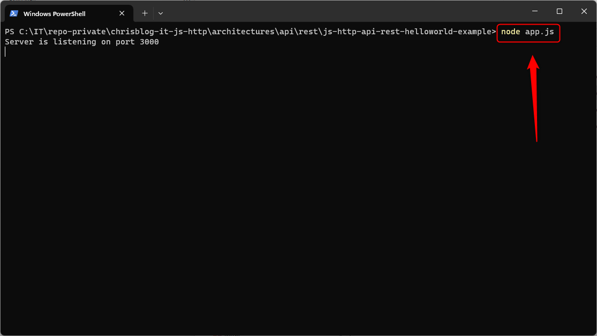
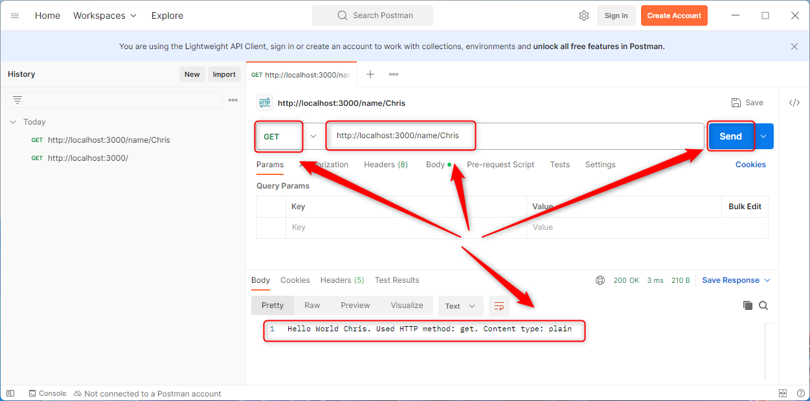
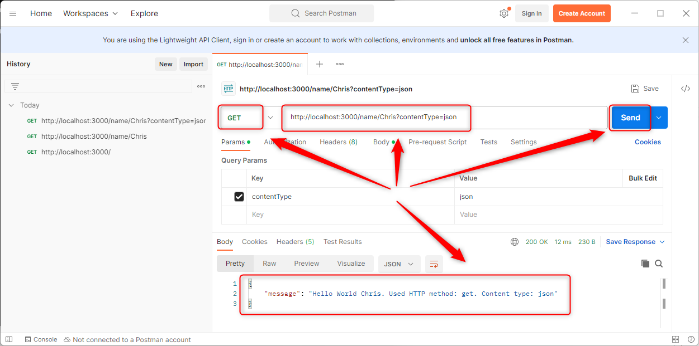

USAGE COMMANDS
--------------

> Please be aware that following tools should be installed in advance on your computer: **node.js**. 

> Please **clone/download** project, open **project's main folder** in your favorite **command line tool** and then **proceed with steps below**. 

Usage steps:
1. In a command line tool start application with `node app.js`
1. In a http client (e.g. Postman) use **GET** method and visit `http://localhost:3000`
   * Expected message: **Please use following URL structure: http://localhost:3000/name/{name} or http://localhost:3000/name/{name}?contentType=json**
1. In a http client (e.g. Postman) use **GET** method and visit `http://localhost:3000/name/{name}` (e.g. `http://localhost:3000/name/Chris`)
   * Expected message: **Hello World Chris. Used HTTP method: get. Content type: plain**
1. In a http client (e.g. Postman) use **GET** method and visit `http://localhost:3000/name/{name}?contentType=json` (e.g. `http://localhost:3000/name/Chris?contentType=json`)
   * Expected message:
   ```
     {
          "message": "Hello World Chris. Used HTTP method: get. Content type: json"
     }  

   ```
1. Clean up environment 
     * In a command line tool stop application with `ctrl + C`


USAGE IMAGES
------------

Start application:



Display result:







DESCRIPTION
-----------

##### Goal
The goal of this project is to present how to create an example application type **API REST** in **JavaScript** programming language with usage **http** library. This application consists of **single** API endpoint and displays **Hello World** message with user **name** and HTTP **method**. Moreover this application can display result in **plain** or **json** format.

##### Terminology
Terminology explanation:
* **JavaScript**: is a scripting or programming language that allows you to implement complex features on web pages or to implement web applications.
* **API REST**: an architectural style for an application program interface (API) that uses HTTP requests to access and use data
* **http library**: is JavaScript library which enables to start web server

##### Flow
The following flow takes place in this project:
1. User via any http client sends request to application for the content.
1. Application sends back response to user via http client with message.

##### Launch
To launch this application please make sure that the **Preconditions** are met and then follow instructions from **Usage** section.

##### Technologies
This project uses following technologies:
* **JavaScript**: `https://docs.google.com/document/d/1wtk8TTIDLsHSvtyUp7uCk-pOKTpmNwMANRGmBNaoBpc/edit?usp=sharing`
* **Node** (section 'Node'): `https://docs.google.com/document/d/1wtk8TTIDLsHSvtyUp7uCk-pOKTpmNwMANRGmBNaoBpc/edit?usp=sharing`


PRECONDITIONS
-------------

##### Preconditions - Tools
* Installed **Operating System** (tested on Windows 11)
* Installed **Node** (tested on version 18.18.1)

##### Preconditions - Actions
* Download **Source Code** (using Git or in any other way) 
* Open any **Command Line** tool (for instance "Windonw PowerShell" on Windows OS) on downloaded **project's main folder**